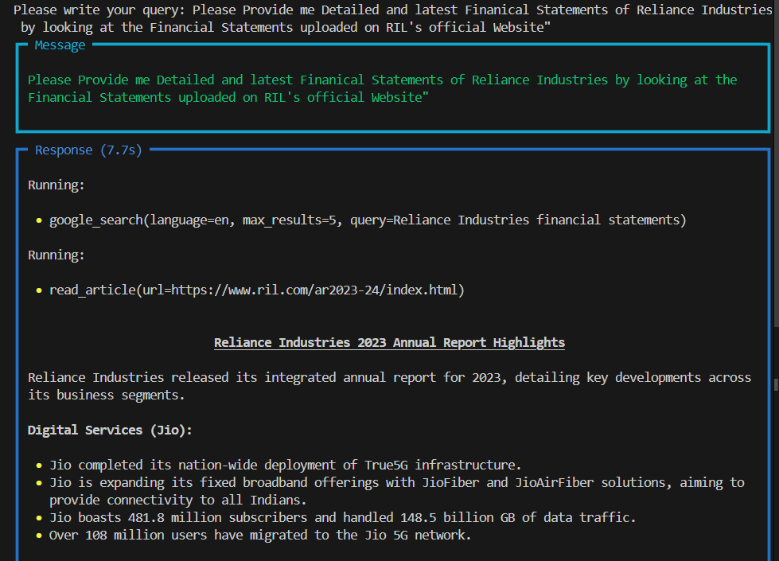
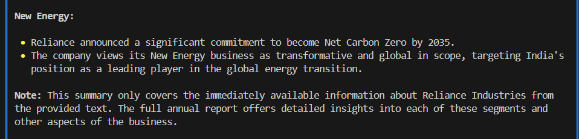
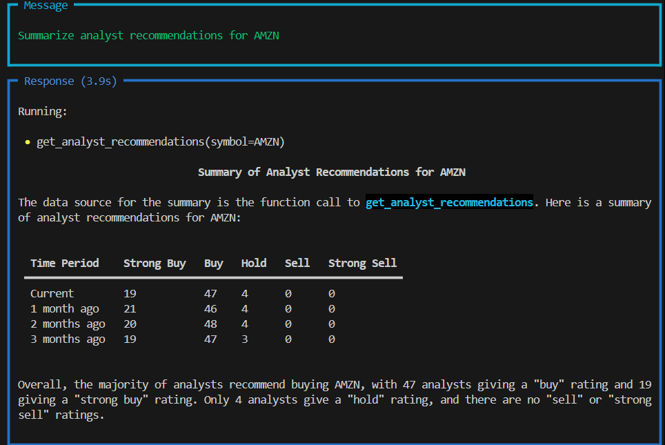
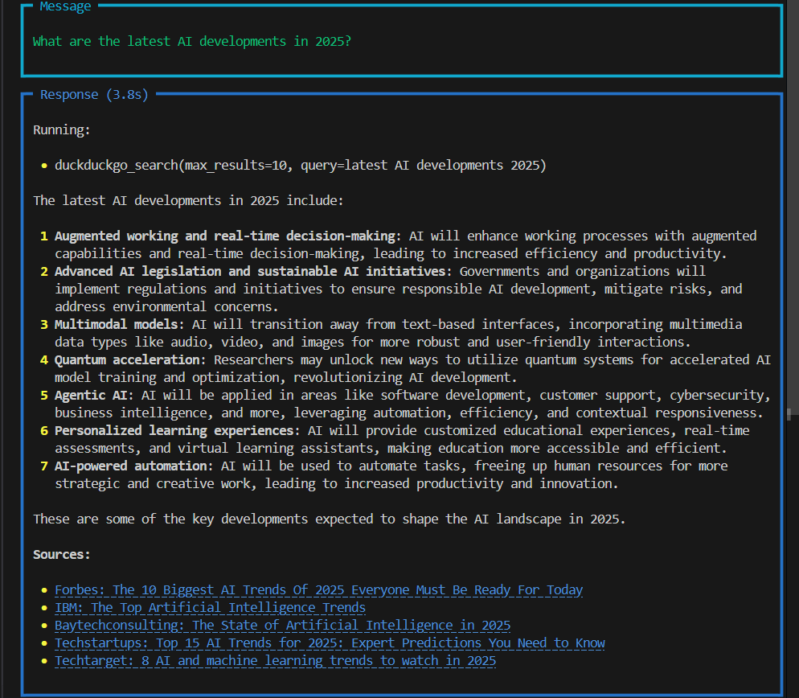

# 🤖 AI Agent System using Phidata

This repository demonstrates a modular AI agent system built with [Phidata](https://phidata.io). It consists of two specialized agents and a master agent that combines their capabilities to provide intelligent, context-aware responses.

---

## 🧠 Overview

### 🔍 Web Search Agent  
Fetches and summarizes real-time information from the web.

### 💰 Finance Agent  
Analyzes financial data, market trends, and economic insights.

### 🤖 Master Agent  
Integrates both Web Search and Finance agents to generate a cohesive, intelligent response.

---

## 📸 Screenshots

### 1. Master Agent Response Example  
*An output generated by combining finance and web data.*

---

### 2. Finance Agent in Action  
*Querying and interpreting financial data.*

---

### 3. Web Search Agent  
*Summarized results from a real-time web search.*

---

## 🚀 Getting Started

### Prerequisites

- Python 3.8+
- `phidata` library installed
💬 Note: Two screenshots are provided for the Master Agent to show a multi-part response.
